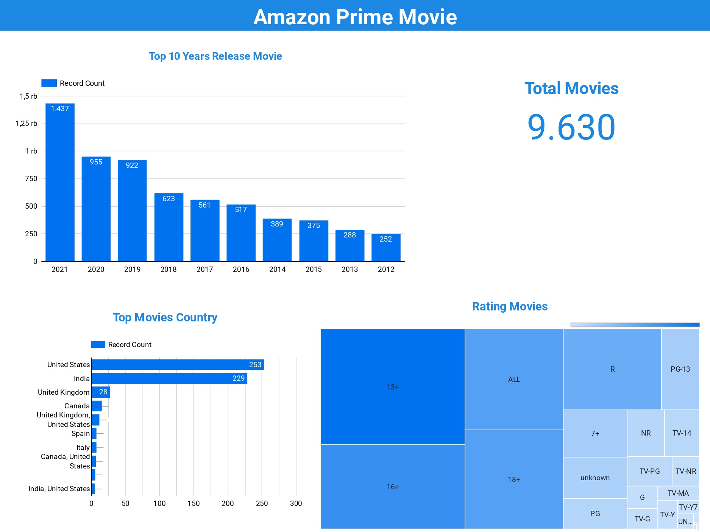

# Amazon Movies
Dashboard Link :
https://lookerstudio.google.com/reporting/6734d2fa-7954-4e85-99bf-dc93855f81cd

## Data Requirements Gathering

Data bersumber dari Kaggle.com yang berjudul Amazon Prime Movies and TV Shows. Dataset terdiri dari 10 kolom dan 9668 baris berikut definisi kolom-kolom yang akan di analisa :
- show_id : Kode unik Film
- type : Tipe Film
- title : Judul Film
- director : Sutradara Film
- cast : Pemain Film
- country : Asal Negara Film
- date_added : Tanggal Rilis Film
- release_year : Tahun Rilis Film
- rating : Usia Penonton
- duration : Durasi Film

## Problem Statement

Amazon membutuhkan suatu Dashboard monitoring untuk film-film yang telah di edarkan.

### Solusi
Pembuatan alat monitoring untuk membantu para pemangku kepentingan di amazon untuk memahami informasi dengan mudah.

### Metrics
- Top 10 Years Release Movies
- Total Movies
- Top Movies By Country
- Rating Movies

## Data Cleansing

Dalam pembuatan Dashboard kolom yang digunakan antara lain :
- release_year : Tahun Rilis Film
- country : Asal Negara Film
- rating : Usia Penonton

Proses Data
- release_year tidak memiliki nilai missing value
- country memiliki nilai missing value, yang diganti dengan undefined
- rating memiliki nilai missing value, yang diganti dengan unknown

## Dashboard Preview
